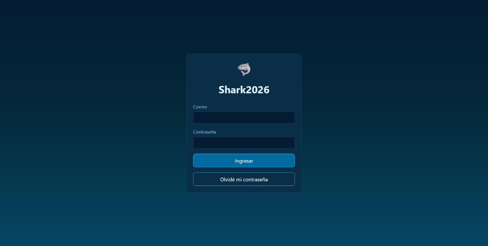

<div align="center">

# 🦈 Shark2026

**Sistema interno de inventario, ventas y turnos** — hecho a medida para una tienda con varios módulos rotativos.

[](https://github.com/savkacarvajal/shark2026/actions/workflows/deploy.yml)
[](https://savkacarvajal.github.io/shark2026/)
[](https://astro.build)
[](https://firebase.google.com)



**[🔗 Ver sitio en vivo](https://savkacarvajal.github.io/shark2026/)**

</div>

---

## 📋 Índice

- [¿Qué hace?](#-qué-hace)
- [Módulos de la tienda](#-módulos-de-la-tienda)
- [Stack técnico](#-stack-técnico)
- [Estructura del proyecto](#-estructura-del-proyecto)
- [Correrlo en local](#-correrlo-en-local)
- [Conectar/reconectar Firebase](#-conectarreconectar-firebase)
- [Comandos disponibles](#-comandos-disponibles)
- [Seguridad](#-seguridad)

## ✨ ¿Qué hace?

- 🛒 **Ventas** — registra ventas eligiendo vendedor y medio de pago; descuenta stock automáticamente y de forma segura aunque dos personas vendan al mismo tiempo en el mismo módulo.
- 📦 **Inventario en tiempo real** — el stock se actualiza al instante en todas las pantallas, sin recargar.
- 📉 **Merma** — descuenta stock por productos dañados, vencidos o perdidos, dejando registrado el motivo.
- 🗂️ **Catálogo** — administración de productos por categoría, con precio y observaciones.
- 🗓️ **Horarios rotativos** — planilla semanal donde cada vendedor queda asignado a un módulo por día (son rotativos entre los 4 locales), con hora opcional para turnos parciales.
- ⏱️ **Registro de asistencia** — marca de llegada, salida a colación, vuelta de colación y salida.
- 🔐 **Roles** — administradoras ven los 4 módulos; cada módulo ve solo lo suyo. Reforzado con reglas de seguridad en la base de datos, no solo en la app.

## 🏬 Módulos de la tienda

| Módulo |
| :--- |
| Centro |
| Mall Plaza – Sol |
| Mall Plaza – Punto |
| Mall Vivo Coquimbo |

## 🧱 Stack técnico

| Parte | Herramienta | Por qué |
| :--- | :--- | :--- |
| Frontend | [Astro](https://astro.build) | Sitio liviano, poco JavaScript enviado al navegador |
| Backend | [Firebase](https://firebase.google.com) | Authentication (login) + Firestore (base de datos en tiempo real) |
| Hosting | GitHub Pages | Gratis, se actualiza solo con cada `git push` a `master` |
| CI/CD | GitHub Actions | Compila y despliega automáticamente |

## 📁 Estructura del proyecto

```
src/
├─ pages/                → cada archivo es una pantalla
│  ├─ login.astro
│  ├─ dashboard.astro
│  ├─ inventario.astro
│  ├─ ventas.astro
│  ├─ ventas/historial.astro
│  ├─ horarios.astro
│  └─ productos/index.astro
├─ layouts/               → estructura visual compartida (menú, colores)
├─ lib/
│  ├─ constants.ts          → módulos, categorías de productos, medios de pago
│  ├─ guards.ts              → protege páginas que requieren login
│  ├─ escapeHtml.ts           → evita XSS al mostrar datos en pantalla
│  └─ firebase/                → todo lo que habla con Firebase (auth, productos, stock, ventas, horarios)
scripts/
├─ setup-accounts.ts     → crea las 6 cuentas reales + módulos + vendedores
├─ seed-products.ts       → carga el catálogo completo de productos
└─ seed-data/products.json
firestore.rules          → reglas de seguridad de la base de datos
```

## 💻 Correrlo en local

```sh
npm install
npm run dev
```

Abre `http://localhost:4321`. Necesita el archivo `.env` con la configuración de Firebase (ver abajo) para que el login y los datos funcionen.

<details>
<summary>🔍 <strong>Modo vista previa</strong> (ver el diseño sin iniciar sesión)</summary>

<br>

Solo funciona en local (`npm run dev`), nunca en el sitio publicado. Agrega `?preview=admin` o `?preview=<id-del-módulo>` a cualquier URL, por ejemplo:

```
http://localhost:4321/inventario?preview=admin
http://localhost:4321/ventas?preview=plaza-sol
```

Muestra datos de ejemplo en vez de conectarse a Firebase — útil para revisar cambios de diseño rápido.

</details>

## 🔥 Conectar/reconectar Firebase

<details>
<summary>Ver los pasos completos</summary>

<br>

1. Crear el proyecto en [console.firebase.google.com](https://console.firebase.google.com)
2. Activar **Authentication** (método Correo/Contraseña) y **Firestore Database** (edición Estándar, modo producción)
3. Registrar una app web y copiar la configuración a un archivo `.env` en la raíz (usar `.env.example` como base)
4. Descargar la clave de cuenta de servicio (Configuración del proyecto → Cuentas de servicio → Generar nueva clave privada) y guardarla como `serviceAccountKey.json` en la raíz del proyecto — **nunca se sube a GitHub**, ya está en `.gitignore`
5. Correr `npm run setup-accounts` → crea las 6 cuentas reales, los 4 módulos y el roster de vendedores
6. Correr `npm run seed-products` → carga el catálogo completo
7. Desplegar las reglas de seguridad:
   ```sh
   npx firebase login
   npx firebase deploy --only firestore:rules,firestore:indexes --project <tu-project-id>
   ```
8. Para que el sitio publicado (GitHub Pages) también se conecte, cargar la misma configuración del paso 3 como **Variables** del repositorio en GitHub → Settings → Secrets and variables → Actions → Variables (`PUBLIC_FIREBASE_API_KEY`, `PUBLIC_FIREBASE_AUTH_DOMAIN`, etc.)

</details>

## 🧞 Comandos disponibles

| Comando | Qué hace |
| :--- | :--- |
| `npm run dev` | Corre el sitio en local para desarrollar |
| `npm run build` | Genera la versión final en `./dist/` |
| `npm run setup-accounts` | Crea/actualiza las 6 cuentas, módulos y vendedores en Firebase |
| `npm run seed-products` | Carga/actualiza el catálogo de productos en Firebase |
| `npx astro check` | Revisa errores de tipos en el código |

## 🔒 Seguridad

- Las reglas de Firestore (`firestore.rules`) son la autoridad real de acceso — cada módulo solo puede leer/escribir sus propios datos, verificado en el servidor, no solo en la app.
- Todo el texto que viene de la base de datos se escapa antes de mostrarse en pantalla (`escapeHtml.ts`), para evitar inyección de código.
- Las contraseñas de las cuentas y la clave de administrador nunca se suben al repositorio.

